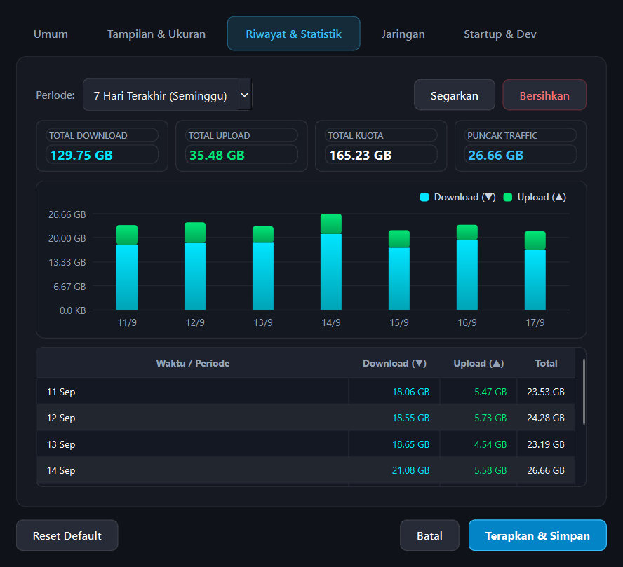
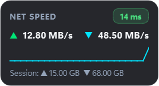
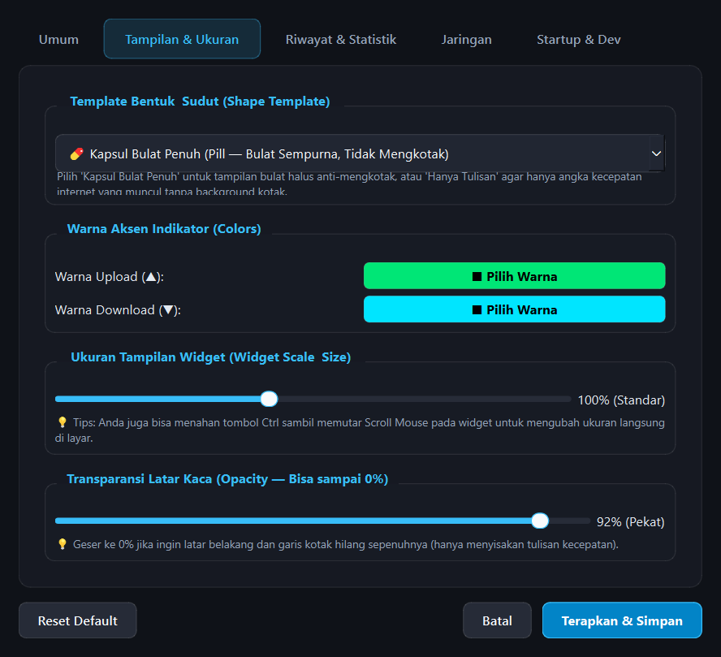
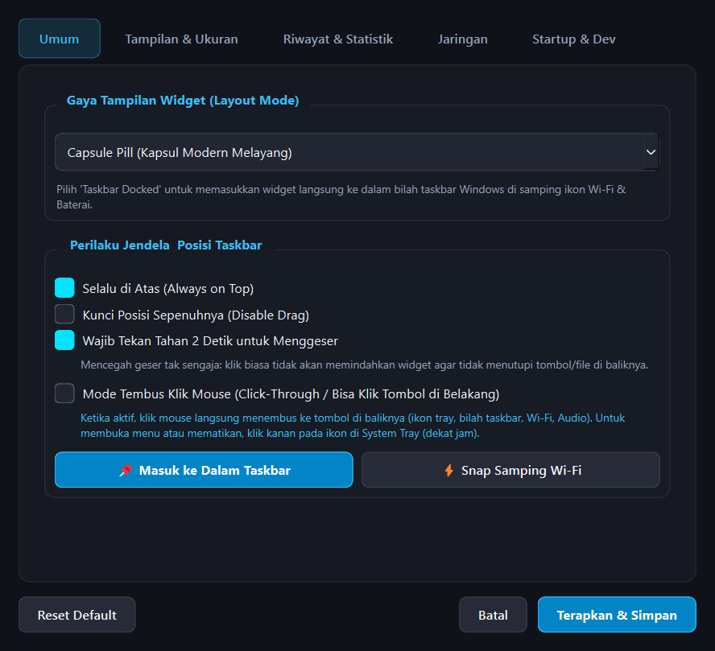

# ⚡ Net Speed Meter

[](https://python.org)
[](https://pyside.org)
[](https://microsoft.com/windows)
[](https://opensource.org/licenses/MIT)

A sleek, lightweight, and modern real-time internet speed monitor & data usage analytics widget for **Windows 10 & Windows 11**. Built with Python & PySide6 (Qt6), featuring Windows 11 Fluent Design, translucent glassmorphism, persistent SQLite traffic history tracking, interactive analytics charts, and customizable neon accents.

---

## 📸 Tangkapan Layar (Screenshots Preview)

### 📊 Riwayat Penggunaan Data & Grafik Statistik
> Tampilan dialog pengaturan tab **Riwayat & Statistik** yang mencatat akumulasi traffic harian, mingguan, bulanan, dan bulan tertentu secara persisten dilengkapi grafik batang bertumpuk neon (*Interactive Stacked Bar Chart*) dan tabel rincian data.

<p align="center">
  
</p>

---

### 🎨 Tampilan Widget di Layar (Desktop & Taskbar)

| Mode Floating Glass Card (Detail + Grafik) | Mode Capsule Pill (Kapsul Melayang) | Mode Text Only (Hanya Tulisan) |
| :---: | :---: | :---: |
|  |  |  |

---

### ⚙️ Pengaturan Tampilan, Bentuk & Perilaku Window

| Tab Tampilan & Ukuran (Shape & Opacity 0%) | Tab Umum (Mode Layout & Click-Through) |
| :---: | :---: |
|  |  |

---

## 🌟 Fitur Unggulan (Key Features)

### 1. 📊 Riwayat & Statistik Penggunaan Kuota (Traffic History & Analytics)
- **Penyimpanan Lokal Persisten**: Otomatis merekam dan menjumlahkan penggunaan download & upload per jam ke database lokal SQLite (`~/.speed_meter/traffic_history.db`).
- **4 Rentang Periode Analisis**:
  - 🕒 **Hari Ini (24 Jam)**: Rincian penggunaan data per jam (00:00 s/d 23:00).
  - 📅 **7 Hari Terakhir (Seminggu)**: Rekapitulasi pemakaian data harian selama 1 minggu terakhir.
  - 📆 **30 Hari Terakhir (Sebulan)**: Rekapitulasi pemakaian data harian selama 1 bulan terakhir.
  - 🗓️ **Pilih Bulan Tertentu (*Custom Month*)**: Memilih arsip bulan dan tahun mana pun yang tersimpan di histori.
- **Ringkasan Kartu Metrik (KPI Cards)**: Menampilkan total Download, total Upload, Total Kuota Gabungan, dan Puncak Penggunaan (*Peak Traffic*).
- **Grafik Batang Interaktif (*Interactive Stacked Bar Chart*)**: Visualisasi batang bertumpuk neon Download (Cyan) & Upload (Emerald) dengan skala Y adaptif dan *hover tooltip* interaktif.
- **Tabel Rincian Data**: Rincian angka akurat per baris waktu/tanggal beserta tombol **Segarkan** dan **Bersihkan**.

### 2. 🚀 Real-Time Speed Telemetry
- Memantau kecepatan unduh (*download*) dan unggah (*upload*) secara akurat dan responsif dengan interval pembaruan yang dapat disesuaikan (500ms, 1 detik, 2 detik).
- Indikator latensi jaringan (*Ping*) dan penghitung kuota sesi berjalan.

### 3. 🎨 3 Mode Tampilan Layout
- **Capsule Pill**: Kapsul melayang modern di atas layar.
- **Taskbar Docked**: Menyatu rapi di bilah taskbar Windows di samping ikon Wi-Fi & Baterai.
- **Floating Glass Card**: Kartu detail lengkap dengan grafik sparkline mini, latensi ping, dan total pemakaian sesi.

### 4. 📐 4 Template Bentuk (Anti-Mengkotak)
- 💊 **Kapsul Bulat Penuh (*Pill*)**: Ujung membulat sempurna setengah lingkaran (`border-radius: 9999px`).
- 🔘 **Badge Melengkung (*Badge*)**: Oval melengkung halus dan proporsional.
- 🫧 **Melengkung Modern (*Rounded*)**: Sudut membulat 12px bergaya Fluent Design.
- ✨ **Hanya Tulisan (*Text-Only*)**: Bersih tanpa kotak latar belakang dan tanpa border.

### 5. 🖱️ Mode Tembus Klik (*Click-Through*)
- Semua klik mouse langsung menembus widget menuju tombol, ikon tray, atau jendela di belakangnya tanpa terhalang.
- Tetap dapat dikontrol dengan mudah kapan saja melalui klik kanan pada **Ikon System Tray** (dekat jam).

### 6. 🎚️ Transparansi Penuh (0% - 100% Opacity)
- Slider opasitas fleksibel hingga 0% (transparan murni hanya tulisan tanpa kotak latar belakang).

### 7. 📌 Always on Top & Kunci Posisi
- Mencegah widget tergeser secara tidak sengaja dengan opsi kunci posisi atau fitur **Wajib Tekan Tahan 2 Detik** untuk menggeser.

---

## 🛠️ Instalasi & Menjalankan dari Source

### Persyaratan:
- Windows 10 atau Windows 11
- Python 3.10 atau versi yang lebih baru

### Langkah-langkah:
1. **Clone repository ini**:
   ```bash
   git clone https://github.com/siput-bersenjata/Net-Speed-Meter.git
   cd Net-Speed-Meter
   ```

2. **Install dependensi**:
   ```bash
   pip install -r requirements.txt
   ```
   *(atau `pip install PySide6 psutil pywin32`)*

3. **Jalankan aplikasi**:
   ```bash
   python main.py
   ```

---

## 🖱️ Pintasan & Kontrol (Shortcuts & Controls)

- **Klik Kanan Widget**: Membuka context menu (Mode, Template Bentuk, Tembus Klik, Kunci Posisi, Pengaturan).
- **Ikon System Tray (Dekat Jam)**:
  - **Klik Kiri**: Tampilkan / Sembunyikan widget.
  - **Klik Ganda**: Buka menu Pengaturan & Riwayat.
  - **Klik Kanan**: Menu lengkap (selalu dapat diakses meskipun Mode Tembus Klik aktif).
- **Ctrl + Scroll Mouse**: Mengubah ukuran/skala widget secara instan (65% s/d 150%).
- **Geser Widget (Drag)**: Tahan klik kiri selama 2 detik lalu geser ke posisi mana pun yang diinginkan.

---

## 📄 Lisensi

Didistribusikan di bawah lisensi MIT. Silakan gunakan, modifikasi, dan kembangkan sesuka Anda.
